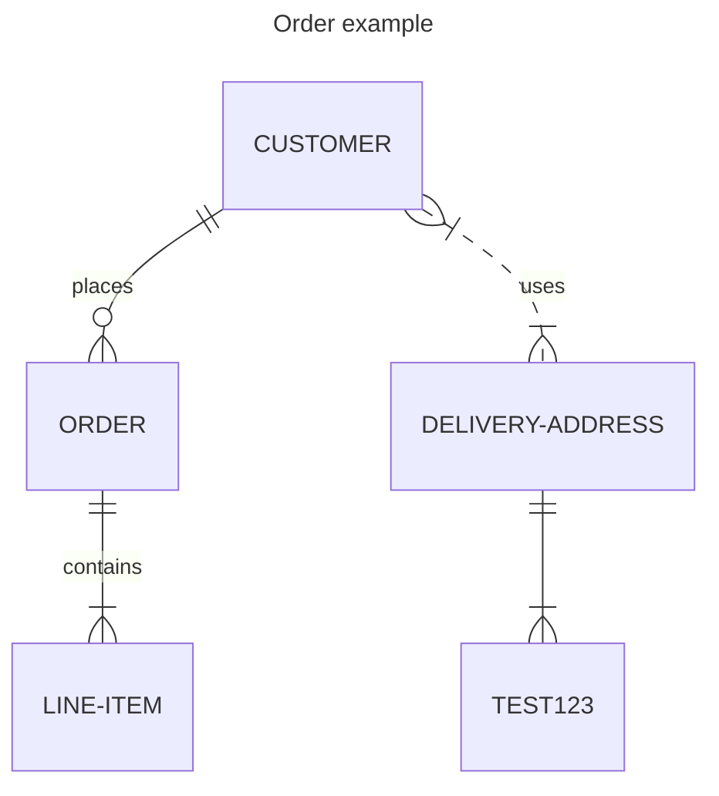
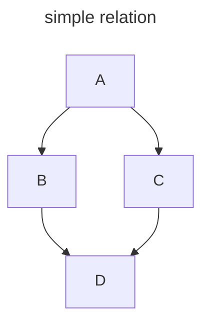
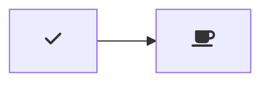
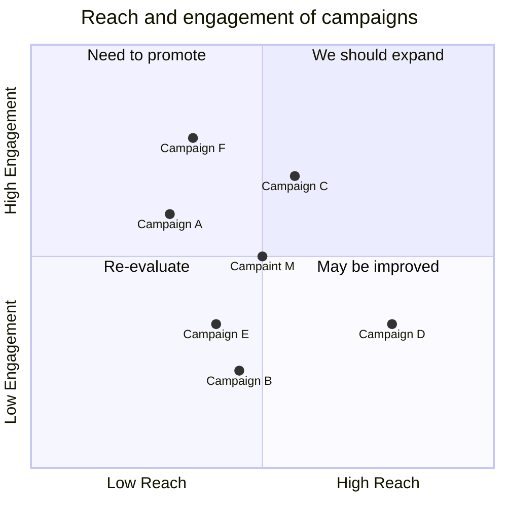
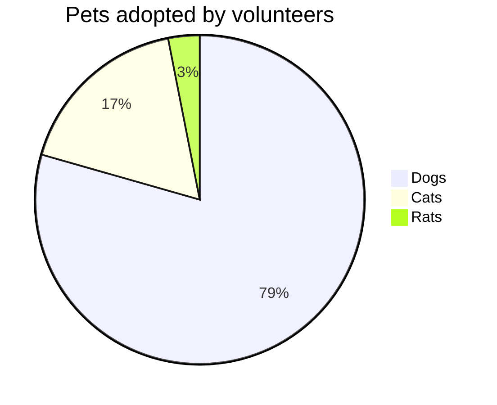
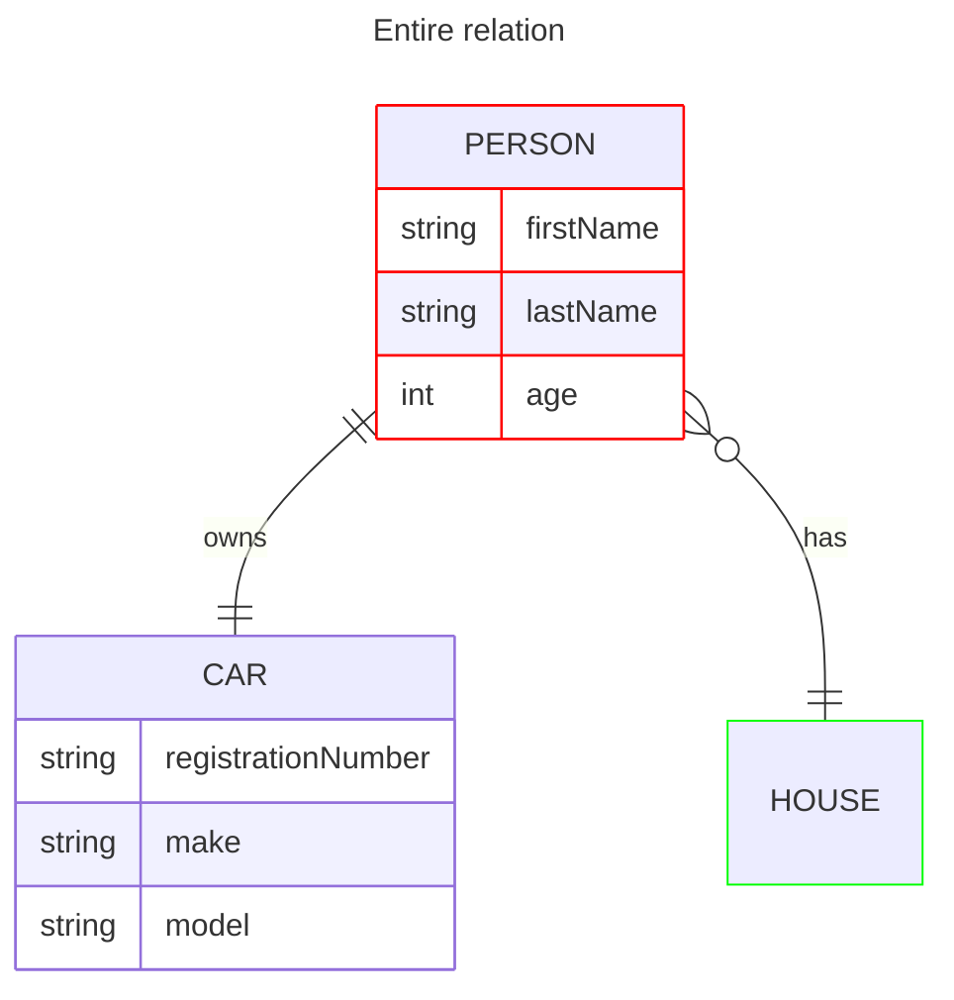

# https://mermaid.js.org/syntax/entityRelationshipDiagram.html

### Mai jos sunt cateva exemple. La link-ul de mai sus se gasesc mai multe

Pot vedea diagrama in preview-ul din VSCode

```mermaid
---
title: Order example
---
erDiagram
    CUSTOMER ||--o{ ORDER : places
    ORDER ||--|{ LINE-ITEM : contains
    CUSTOMER }|..|{ DELIVERY-ADDRESS : uses
    DELIVERY-ADDRESS ||--|{TEST123: ""

```

```mermaid
---
title: simple relation
---
graph TD;
    A-->B;
    A-->C;
    B-->D;
    C-->D;
```

```mermaid
graph LR
    fa:fa-check-->fa:fa-coffee
```

```mermaid
---
title: Quadrant
---
quadrantChart
    title Reach and engagement of campaigns
    x-axis Low Reach --> High Reach
    y-axis Low Engagement --> High Engagement
    quadrant-1 We should expand
    quadrant-2 Need to promote
    quadrant-3 Re-evaluate
    quadrant-4 May be improved
    Campaign A: [0.3, 0.6]
    Campaign B: [0.45, 0.23]
    Campaign C: [0.57, 0.69]
    Campaign D: [0.78, 0.34]
    Campaign E: [0.40, 0.34]
    Campaign F: [0.35, 0.78]
    Campaint M: [0.50, 0.50]
```

```mermaid
---
title: Piechart
---
pie title Pets adopted by volunteers
    "Dogs" : 386
    "Cats" : 85
    "Rats" : 15
```

```mermaid
---
title: Entire relation
---
erDiagram
    CAR {
        string registrationNumber
        string make
        string model
    }
    PERSON {
        string firstName
        string lastName
        int age
    }
    PERSON:::foo ||--|| CAR : owns
    PERSON o{--|| HOUSE:::bar : has

    classDef foo stroke:#f00
    classDef bar stroke:#0f0
    classDef foobar stroke:#00f
```